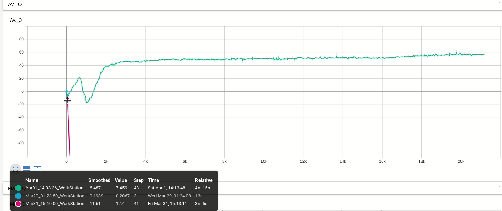
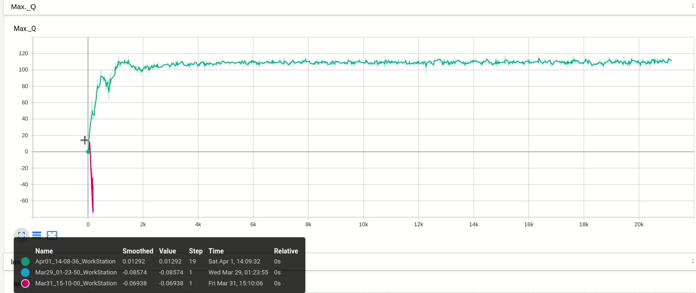
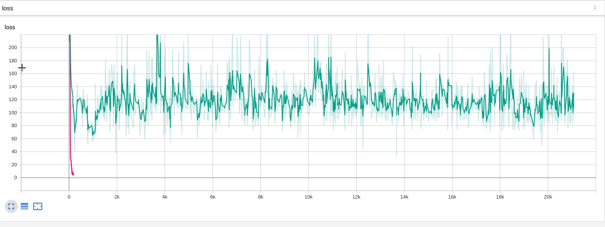

# &#x20;twin-delayed deep deterministic policy gradient (TD3) 网络训练移动机器人

## 目录

-   [1 项目简介](#1-项目简介)

-   [2 项目来源](#2-项目来源)

-   [3 项目使用方式](#3-项目使用方式)

-   [4训练效果](#4训练效果)

-   [ 5 Reward](#-5-Reward)


# 1 项目简介

在ROS/Gazebo场景下，通过twin-delayed deep deterministic policy gradient (TD3) 算法，机器人以激光点云及当前位姿为state，机器人的控制量速度$v$和角速度$w$为action，强化训练移动机器人，使其实现在动态环境中的自主导航

# 2 项目来源

开源算法：[https://github.com/reiniscimurs/DRL-robot-navigation](https://github.com/reiniscimurs/DRL-robot-navigation "https://github.com/reiniscimurs/DRL-robot-navigation")

# 3 项目使用方式

-   复制仓库信息

```bash
git clone https://e.coding.net/donkehuang/deeplearningexercise/DRL-robot-navigation.git
```

-   编译环境包

```bash
export ROS_HOSTNAME=localhost  
export ROS_MASTER_URI=http://localhost:11311  
export ROS_PORT_SIM=11311  
export GAZEBO_RESOURCE_PATH=~/DRL-robot-navigation/catkin_ws/src/multi\_robot_scenario/launch  
source ~/.bashrc  
cd ~/DRL-robot-navigation/catkin_ws  
source devel/setup.bash

```

-   训练网络
    -   默认下载有训练网络好的参数结果，自行训练会更新结果

```bash
cd ~/DRL-robot-navigation/TD3  
python3 train_velodyne_td3.py

```

-   停止训练

```bash
killall -9 rosout roslaunch rosmaster gzserver nodelet robot_state_publisher gzclient python python3
```

-   测试网络结果

```bash
cd ~/DRL-robot-navigation/TD3  
python3 test_velodyne_td3.py

```


# 4训练效果

-   效果图


-   Average Q



-   Max  Q



-   Loss



# &#x20;5 Reward

-   到达目标r += 100
-   未到达 r-=100
-   碰撞（min\_laser\_dis< obstacle\_dis）r-=100
-   平滑性控制：r+ = v-|w|
